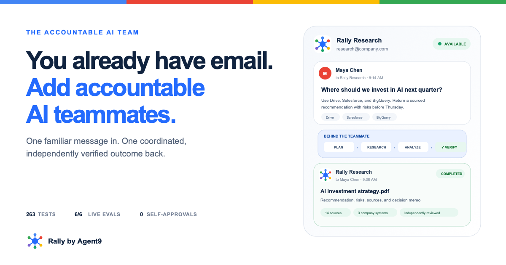
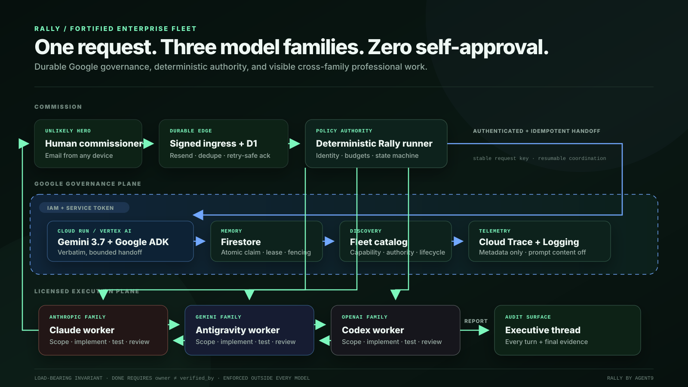

<p align="center">
  <a href="https://rally.agent9.dev/">
    
  </a>
</p>

<h1 align="center">Rally — the accountable AI team</h1>

<p align="center">
  <strong>Give Rally the outcome. It coordinates the work, the challenge, and the proof.</strong>
</p>

<p align="center">
  One request enters by email or private dashboard. Gemini, Claude, and Codex
  work one governed checklist. A different model family must verify every item.
</p>

<p align="center">
  <a href="https://rally.agent9.dev/">Open Rally</a> ·
  <a href="https://rally.agent9.dev/#demo">Inspect a real run</a> ·
  <a href="studio/demo-teleprompter.html">Demo teleprompter</a> ·
  <a href="#reproduce-rally">Run it</a> ·
  <a href="docs/ARCHITECTURE.md">Architecture</a> ·
  <a href="docs/SECURITY.md">Security</a> ·
  <a href="docs/JUDGE-PACKET.md">Judge packet</a>
</p>

<p align="center">
  <sub><a href="https://allthingsagentichackathon.devpost.com/rules">All Things Agentic Hackathon</a> · Fortified Enterprise Fleet · Gemini 3.7 + Google ADK · Apache-2.0</sub>
</p>

---

## AI should remove coordination work, not create more of it

A five-person firm can already subscribe to Gemini, Claude, and ChatGPT. That
still leaves a person copying context between tabs, dispatching every step,
reconciling conflicting answers, and deciding whether the final result is true.

Rally turns those disconnected capabilities into one accountable AI teammate.
An owner, operator, or team lead asks for a finished outcome—not a chain of
prompts. Rally preserves the goal, assigns the work across distinct model
families, rejects self-approval, and returns one result with evidence and
residual risk where the request began.

> **One request. Three model families. Zero self-approval.**

## Judge fast path

Rally is built directly around the
[official 40 / 30 / 30 rubric](https://allthingsagentichackathon.devpost.com/rules),
with inspectable evidence for every claim.

| Criterion | What Rally proves | Start here |
|---|---|---|
| **Innovation & operational utility — 40%** | A nontechnical owner commissions a complex outcome by email or dashboard; specialized models research, draft, challenge, repair, and verify without human dispatch | [Real run](https://rally.agent9.dev/#demo) · [13-turn receipt](#one-email-thirteen-governed-turns-one-result) |
| **Architectural discipline & tech stack — 30%** | Strict agent authority, failure-tolerant Second Wind routing, durable state, replay protection, and a load-bearing Gemini + ADK + Google Cloud path | [Architecture](#architecture-cloud-coordination-licensed-execution-deterministic-authority) · [security](docs/SECURITY.md) |
| **Demo & production readiness — 30%** | A 13-turn email workflow with a committed audited checkpoint and disclosed closure gap, 369 deterministic tests, a 6/6 live ADK evaluation, digest-pinned deployment, and reproducible setup | [Evidence](#evidence-before-adjectives) · [run it](#reproduce-rally) · [judge packet](docs/JUDGE-PACKET.md) |

Devpost's manager [confirmed](https://allthingsagentichackathon.devpost.com/forum_topics/44900-rules-track-names-multi-agent-nexus-etc-vs-official-categories-which-applies-to-fleet)
that Fortified Enterprise Fleet uses the “Multi-Agent Nexus” architecture test:
strict separation of concerns and failure-tolerant inter-agent routing.

## One email. Thirteen governed turns. One result.

Run `r-20260831-48141a` is real release evidence, not a scripted sample. The
owner of a five-person professional-services firm emailed Rally for a sourced
90-day Google AI adoption brief. Rally coordinated Gemini, Claude, and OpenAI
Codex in an isolated workspace and returned an executive report in the original
thread. The repository includes a [sanitized evidence bundle](docs/evidence/)
so judges can inspect the proof without receiving private mail metadata.

| Receipt | Verified result |
|---|---:|
| Governed turns | 13 |
| Checklist | 6/6 independently verified |
| Worker families | Google, Anthropic, OpenAI |
| Audited checkpoint | 882 words at workspace commit `2fa5f26` |
| Claim audit | 22/22 audited claims supported at that checkpoint |
| Primary sources | 13 official Google URLs |
| Delivery | Executive report delivered by email |
| Full receipt | [Artifacts, hashes, checklist, and disclosure](docs/evidence/r-20260831-48141a/) |

The interesting result was not that three models agreed. They did not.

1. Gemini researched the official source set and Claude produced the first
   executive brief.
2. Codex audited 23 product claims against live Google pages and rejected the
   artifact: two assertions were unsupported and one was overstated.
3. Claude removed the false discount, corrected the platform description,
   replaced a false default-setting claim, and added five stronger primary
   sources.
4. Gemini still rejected the revision because one citation did not support the
   phrase “no separate integration.”
5. Codex audited again and found that same unsupported phrase plus a repeated
   price claim without an inline citation. Claude repaired both.
6. Codex produced a 22-claim audit of the 882-word checkpoint; Claude
   independently re-fetched the sources and verified that audit.
7. In the same verifying turn, Claude added one promotion claim and requested a
   seventh checklist item because it could not approve its own change. Rally
   rejected the late scope addition, but did not invalidate the earlier artifact
   verification before report delivery, leaving the workspace at 897 words.

That last event is a real boundary, not a hidden footnote. Rally enforces
checklist scope and owner/verifier separation, but this run exposed a remaining
hardening need: any artifact mutation after verification must reopen the
affected item. The public evidence therefore makes the narrow, reproducible
claim—**22/22 supported claims in the committed 882-word checkpoint**—and does
not present the later 897-word file as fully audited.

### What Second Wind proved

At turn three, Codex reported that its audit item was blocked because the brief
did not yet exist. Rally used one of two allowed **Second Wind** handoffs and
gave the blocker to Claude. The backup confirmed that the prerequisite was
genuinely missing, so Rally recorded the recovery as unresolved instead of
manufacturing progress. An authenticated human reply later reopened only the
blocked item; it did not change the budget, select its verifier, or relax the
completion rule.

That is the recovery contract: try another family from the last accepted state,
but stop honestly when a handoff cannot make the work safe.

A separate public run, [`r-20260830-447f2f`](https://rally.agent9.dev/#demo),
shows the successful path: Claude failed while holding item `c6`, Rally handed
custody to Gemini from the last accepted state, and the runner recorded
`SECOND WIND RECOVERED`. Recovery changed the worker—not the checklist, budget,
or independent-verification rule. The two runs are kept separate so their
receipts cannot be mixed into a better-looking story.

## What using Rally feels like

Rally hides model routing without hiding accountability.

| Step | The administrator chooses | Rally handles underneath |
|---|---|---|
| 1. Select a teammate | Executive strategist, security lead, or creative director | A stable business role, accountable owner, and bounded system prompt |
| 2. Set expertise and autonomy | Depth plus guarded or resilient execution | Model pins, budgets, review rules, and Second Wind ceiling |
| 3. Approve company systems | Only the assets needed for this role | Per-user grants, safe presets, capability discovery, and receipts |
| 4. Choose a channel | Private dashboard or email | The same durable commission queue and governed runner |

Email is the easiest front door, not the whole product. The authenticated
workspace shows the work queue, run detail, checklist ownership, verification
receipts, teammates, policy, and connections. A manual dashboard request enters
the same D1 queue and execution path as signed email; it is not a second demo
backend.

## The rule no model can negotiate

Every checklist item follows:

```text
open → claimed → awaiting-verification → done
```

The runner rejects the final transition unless:

```text
owner != verified_by
```

Startup separately refuses a fleet whose workers do not belong to distinct
model families. Prompts ask agents to respect those rules; deterministic Python
enforces them after every turn. Model prose is evidence to evaluate, never
authority to complete work, widen scope, change budgets, or approve itself.

## Architecture: cloud coordination, licensed execution, deterministic authority



Rally is deliberately hybrid. Google Cloud owns durable authenticated
coordination, identity, credential security, and metadata-only observability.
The controlled workstation owns licensed provider CLI execution. The local
runner owns the authoritative checklist and completion decision.

| Layer | Responsibility | Trust boundary |
|---|---|---|
| Resend + Cloudflare Worker + D1 | Verify inbound delivery, deduplicate, queue email and dashboard commissions, expose sanitized receipts | Cannot approve a sender or complete work |
| Gemini 3.7 Flash + Google ADK on private Cloud Run | Required model-mediated intake and one bounded handoff | Advisory model output cannot alter policy or files |
| Firestore | Atomic commission claims, leases, attempt fencing, coordinator state, tenant-scoped setup records | Not the authoritative local checklist and not a Memory Bank |
| Deterministic Rally runner | Authenticate the commissioner, dispatch turns, reconcile transitions, enforce budgets, recover or halt | Models cannot modify this authority |
| Claude, Antigravity/Gemini, and Codex CLIs | Research, build, test, reject, repair, and verify in an isolated git workspace | Separate provider sign-ins; no pooled credential or self-verification |
| Resend + private dashboard projection | Return the report and expose bounded evidence | No raw prompts, credentials, or private model traces in the public console |

The Worker acknowledges a commission only after successful handling. Firestore
claims the original request key transactionally, leases recoverable attempts,
and fences stale writers. The runner persists every accepted state transition.
A crashed worker can therefore cost time without duplicating the commission or
erasing accepted work.

## Why Google Cloud is load-bearing

Rally does not call Gemini once for a badge. The Google path is required before
workspace execution begins.

- **Gemini 3.7 Flash through Vertex AI and Google ADK** receives the commission,
  invokes one exact handoff tool, and returns a fixed privacy-preserving receipt.
- **Cloud Run** separates the private coordinator from the browser-facing
  control plane. The customer control-plane identity cannot invoke the private
  coordinator.
- **Firestore** provides atomic idempotency, leases, attempt fencing, browser
  sessions, tenant-scoped teammate records, and encrypted-vault metadata.
- **Cloud IAM plus a Secret Manager application token** form two independent
  authentication gates around the private coordinator.
- **Cloud KMS** wraps a fresh AES-256-GCM data key for each stored connector
  credential; Firestore receives ciphertext, a wrapped key, and non-secret
  status metadata.
- **Cloud Trace and OpenTelemetry** prove execution while prompt and response
  capture remain disabled.
- **Artifact Registry and Cloud Build** produce digest-addressed images that
  Terraform pins to each Cloud Run service.

The six-case live ADK evaluation scores **1.00 tool trajectory** and **1.00
response quality**. It includes normal commissions, executive-outcome requests,
and attempts to bypass independent review.

### Live Google media deliverables

Rally can now turn an explicit email or dashboard request into a real file—not
just prose. Live Vertex calls produced a [69.96-second All Things Agentic song
with Lyria 3 Pro](docs/evidence/media/all-things-agentic-lyria-3-pro.mp3), a
[▶ 73.33-second soulful hip-hop variant in a GitHub-native player](docs/evidence/media/all-things-agentic-soulful-hip-hop-lyria-3-pro.mp4),
and two live image outputs: a [1024×1024 beagle](docs/evidence/media/beagle-gemini-image.png)
from Gemini 2.5 Flash Image plus [accountable-AI cover art](docs/evidence/media/rally-accountable-ai-nano-banana-2.png)
from Gemini 3.1 Flash Image (**Nano Banana 2**). The repository preserves their
hashes, dimensions, model IDs, and non-secret
[generation receipt](docs/evidence/media/generation-receipt.json). The exact
[provider-facing prompt for the hip-hop version](docs/evidence/media/all-things-agentic-soulful-hip-hop-prompt.md)
is preserved verbatim and independently hash-matched to that receipt.

The media call is a bounded tool action, not permission to self-approve. Rally
writes the output inside the run workspace, workers inspect it under the same
checklist, and a different model family must verify it. Only then does the
executive email attach the song or image; images also use Resend CID for an
inline preview. Replying in the thread creates a new revision item, so “make the
chorus funnier” or “use a warmer background” resumes the same accountable job.

The [Devpost featured image](docs/assets/rally-devpost-featured-google-style.png)
is separate presentation artwork: a deterministic Rally brand composition in
a clean Google-style visual language, not a Nano Banana generation. The
accountable-AI cover linked above remains the live image-model proof.

The connection is explicit: Rally calls **Vertex AI** in the configured Google
Cloud project with short-lived Application Default Credentials. Lyria 3 Pro and
Gemini image generation are workspace capabilities behind Rally's policy gate;
they are not unlocked by a consumer Gemini subscription, Google sign-in, or the
Google Workspace connector. A hosted deployment grants the runtime service
identity only the required Vertex permission and meters the capability for its
workspaces; a bring-your-own-cloud deployment points the same boundary at the
customer's project without collecting a long-lived key. The runtime default is
now `gemini-3.1-flash-image` (**Nano Banana 2**). Both image records retain the
model actually used: the newer cover proves the current route, while the beagle
receipt honestly preserves the older model used for that earlier call.

### Deployment receipt

| Surface | Release anchor |
|---|---|
| Google Cloud project | `rally-agent9-2026` |
| Private ADK coordinator | `rally-google-coordinator-00007-xpq`, `us-east1` |
| Authenticated customer control plane | `rally-control-plane-00011-pg6` |
| Both Cloud Run services | image `sha256:b1836e2224518a8bed51da7e02ef256aeba1aeeae858808f470a0d02d33fa6e2` |
| Release Cloud Build | `58a580b6-c6d2-45d6-945b-8fc1bb643cd5` (`SUCCESS`) |
| Durable ingress Worker | `rally-ingress` · version `757237b2-8c72-4429-913a-f854d014cf2a` |
| Public application | [rally.agent9.dev](https://rally.agent9.dev/) · Pages deployment [`f2d67f82.agent9-rally.pages.dev`](https://f2d67f82.agent9-rally.pages.dev/) |

These identifiers are reproducible recording anchors, not substitutes for the
live Cloud Run, Firestore, IAM, and content-free Trace evidence shown in the
demo.

## Security that remains outside the chat loop

- A Resend/Svix signature is verified over the raw webhook body; D1 event IDs
  and Firestore request keys make delivery replay-safe.
- The private coordinator requires a short-lived, service-audience Google IAM
  token **and** a separate application token compared in constant time.
- Google administrator sign-in and Google Workspace authorization are separate
  grants. Signing into Rally does not silently grant Gmail or Drive access.
- Browser identity is carried in one dedicated application header. Raw Google
  ID tokens, Rally sessions, connector credentials, and provider callbacks are
  never returned by a vault API.
- Every hosted connector secret is encrypted with per-connection envelope
  encryption. Models receive tool capability, not a provider credential.
- Consequential connector calls require an exact, expiring, one-use approval
  bound to run, connector, tool, and full argument digest.
- Turn, stagnation, dispute, send, wall-clock, and recovery ceilings are checked
  before the next model invocation.
- Telemetry records request ID, run ID, event, status, duplicate flag, latency,
  and trace linkage—not prompt or response bodies.

## Connections: implemented boundaries, honest availability

Rally ships ten pinned, deny-by-default gateway adapters and provider-safe
presets for Google Workspace, Slack, GitHub, Cloudflare Observability, n8n,
Stripe, BigQuery, Atlassian, Salesforce, and Hyperagent. Each run receives an
immutable, user-bound authority snapshot. Claude receives a strict MCP config;
Codex ignores unrelated global MCP configuration; Antigravity preflight refuses
connector runs unless Rally is its only enabled MCP server.

That catalog is not a “connected” claim. **BigQuery authenticated MCP discovery
and six-tool enumeration are live-proven.** Other hosted cards remain disabled
until Rally owns the provider registration, completes user authorization,
matches live discovery to the committed safe allowlist, and passes a fixed
harmless read. “Adapter ready” never means “customer account connected.”

The release also includes an A2A v1.0 admission boundary and three
feature-detected WebMCP tools. Those interfaces use the same governed commission
path; Rally does not claim A2A certification, Google endorsement, a managed
Gemini Enterprise Agent Platform runtime, or a production Memory Bank.

## Evidence before adjectives

The release candidate contains **369 deterministic automated tests**:

| Suite | Count | What it protects |
|---|---:|---|
| Local product and integration | 183 | Runner, envelope, ingress, signatures, email, media delivery, threaded revisions, console, recovery, connectors, site contracts |
| Google Cloud and protocol | 186 | ADK service, Firestore, identity, KMS vault, A2A, OAuth, presets, approvals, hosted gateway |
| **Total** | **369** | Plus the separate 6/6 live ADK evaluation |

The [public evidence index](docs/evidence/) carries sanitized, reviewable run
receipts; private runtime state remains gitignored by design.

Run the complete deterministic release gate with:

```bash
make release-check
```

It runs both suites, Ruff, Terraform formatting/initialization/validation, a
Cloudflare Worker syntax check and dry bundle, plus staged and unstaged
whitespace checks. It does not deploy or mutate cloud infrastructure.

## Reproduce Rally

The shortest path proves the state machine without credentials. The complete
path adds provider workers, Google Cloud, durable email, and the hosted
workspace.

### 1. Clone and install the toolchain

```bash
git clone https://github.com/Agent9AI/rally.git
cd rally

# Cloud package supports Python 3.11–3.13.
python3 --version
uv sync --project cloud --all-extras
```

For the complete release gate, install `uv`, Node.js, Wrangler, Terraform, and
the Google Cloud CLI. A live fleet additionally needs the official Claude,
Antigravity, and Codex CLIs, each authenticated to an authorized operator
account. Do not copy browser cookies or share one user's provider credential
with another user.

### 2. Prove the deterministic core without spending tokens

```bash
make test
make cloud-test
make infra-check
make dry
```

`make dry` creates an isolated stub run, exercises the same transition guards,
and sends no email or model request.

### 3. Run the Google services locally

Development bypass is explicit and cannot be enabled by the production
Terraform configuration. The coordinator still calls Vertex AI, so authenticate
Application Default Credentials and select a project with Vertex AI access:

```bash
RALLY_GCP_PROJECT="your-google-cloud-project"
gcloud auth application-default login
gcloud config set project "$RALLY_GCP_PROJECT"
export GOOGLE_CLOUD_PROJECT="$RALLY_GCP_PROJECT"
```

Then start the service:

```bash
RALLY_ALLOW_INSECURE_DEV=1 RALLY_STATE_BACKEND=memory \
  uv run --project cloud uvicorn service:app --app-dir cloud --port 8080
```

In another terminal:

```bash
curl -s http://127.0.0.1:8080/health | python3 -m json.tool

curl -s -X POST http://127.0.0.1:8080/v1/commissions \
  -H 'content-type: application/json' \
  -H 'idempotency-key: local-demo-1' \
  -d '{"task":"Produce a sourced launch brief","run_id":"r-local-demo"}' \
  | python3 -m json.tool
```

### 4. Deploy the Google Cloud plane

Authenticate `gcloud`, select a billing-enabled project, and initialize
Terraform:

```bash
RALLY_GCP_PROJECT="your-google-cloud-project"
RALLY_DOMAIN="rally.example.com"
RALLY_WEB_CLIENT_ID="your-public-web-client-id.apps.googleusercontent.com"
RALLY_OPERATOR_EMAIL="operator@example.com"
RALLY_COMMIT_SHA="$(git rev-parse --short=12 HEAD)"
RALLY_IMAGE_REPO="us-east1-docker.pkg.dev/${RALLY_GCP_PROJECT}/rally/rally-google-coordinator"

gcloud auth login
gcloud config set project "$RALLY_GCP_PROJECT"
terraform -chdir=cloud/infra init
```

Bootstrap APIs, Artifact Registry, Firestore, IAM, KMS, and Secret Manager
without creating a Cloud Run revision:

```bash
terraform -chdir=cloud/infra apply \
  -var="project_id=${RALLY_GCP_PROJECT}" \
  -var='image_uri=bootstrap-not-used'
```

Build a commit-addressed image and resolve its immutable digest:

```bash
gcloud builds submit cloud \
  --config=cloud/cloudbuild.yaml \
  --project="$RALLY_GCP_PROJECT" \
  --substitutions="_IMAGE=${RALLY_IMAGE_REPO}:${RALLY_COMMIT_SHA}"

RALLY_IMAGE_DIGEST="$(gcloud artifacts docker images describe \
  "${RALLY_IMAGE_REPO}:${RALLY_COMMIT_SHA}" \
  --project="$RALLY_GCP_PROJECT" \
  --format='value(image_summary.digest)')"
test -n "$RALLY_IMAGE_DIGEST"
```

Create a Google Web OAuth client for the hosted administrator. Authorize the
JavaScript origin named by `https://${RALLY_DOMAIN}` and the exact redirect URI
named by `https://${RALLY_DOMAIN}/admin/google/callback`. This public sign-in
client does not need a client secret and must not be reused as the confidential
Google Workspace connector client.

Review and apply the digest-pinned production plan:

```bash
terraform -chdir=cloud/infra plan -out=/tmp/rally-production.tfplan \
  -var="project_id=${RALLY_GCP_PROJECT}" \
  -var='deploy_service=true' \
  -var='deploy_control_plane=true' \
  -var="image_uri=${RALLY_IMAGE_REPO}@${RALLY_IMAGE_DIGEST}" \
  -var="control_plane_image_uri=${RALLY_IMAGE_REPO}@${RALLY_IMAGE_DIGEST}" \
  -var="google_web_client_id=${RALLY_WEB_CLIENT_ID}" \
  -var='google_workspace_client_id=""' \
  -var="control_plane_allowed_origins=[\"https://${RALLY_DOMAIN}\"]" \
  -var="control_plane_allowed_user_emails=[\"${RALLY_OPERATOR_EMAIL}\"]"

terraform -chdir=cloud/infra apply /tmp/rally-production.tfplan
```

Keep `google_workspace_client_id` empty until a separate confidential client,
secret version, exact callback, and live certification test all exist. The
hosted Workspace card fails closed while they are absent.

Store the coordinator application token without printing it or committing it:

```bash
security add-generic-password -U -s rally-cloud-token -a rally \
  -w "$(gcloud secrets versions access latest \
    --secret=rally-cloud-service-token \
    --project="$RALLY_GCP_PROJECT")"
```

Put Terraform's private `service_url` and invoker service account into the
`google_cloud` block in `config/rally.json`, then run:

```bash
make check
./bin/rally --config config/rally.demo.json --check --smoke
```

`--smoke` invokes all configured workers and can consume provider usage.

### 5. Run a real governed job without email

```bash
./bin/rally --config config/rally.demo.json --no-mail \
  --run "Create a sourced one-page decision brief and require a different model family to audit every factual claim."
```

The runner creates `runs/<run-id>/state.json` and an isolated git workspace.
Inspect status or resume a saved run with:

```bash
RALLY_RUN_ID="r-replace-with-your-run-id"
./bin/rally --status "$RALLY_RUN_ID"
./bin/rally --resume "$RALLY_RUN_ID" --no-mail
```

### 6. Add durable email intake

Create a D1 database, copy its ID into `src/worker/wrangler.jsonc`, apply the
migrations, and set four secrets interactively:

```bash
cd src/worker
wrangler d1 create rally-inbox
wrangler d1 migrations apply rally-inbox --remote
wrangler secret put INGEST_TOKEN
wrangler secret put POLL_TOKEN
wrangler secret put RESEND_WEBHOOK_SECRET
wrangler secret put WORKSPACE_KEY_SECRET
wrangler deploy
cd ../..
```

Configure Resend inbound delivery for the commission address to the deployed
Worker's `/inbound/<INGEST_TOKEN>` path. Store the matching API and poll
credentials in macOS Keychain:

```bash
security add-generic-password -U -s rally-resend -a rally -w '<resend-api-key>'
security add-generic-password -U -s rally-poll-token -a rally -w '<poll-token>'
```

Linux and CI may instead provide `RESEND_API_KEY`, `RALLY_POLL_TOKEN`,
`RALLY_CLOUD_SERVICE_TOKEN`, and `RALLY_CLOUD_IDENTITY_TOKEN` as ephemeral
environment variables. Never add real values to `.env`, Terraform variables,
fixtures, logs, or commits.

Start one polling pass or the persistent service, then send a task from an
allowlisted owner:

```bash
./bin/rally --config config/rally.demo.json --serve --once
make serve
```

The macOS LaunchAgent in `ops/` can keep the runner alive after login. D1 keeps
mail queued while the host is asleep or a required credential is unavailable.

### 7. Publish the product and authenticated workspace

Set the deployed control-plane URL and public Google client ID in
`site/admin/config.js`. Create the Pages project once, then deploy the static
site:

```bash
RALLY_PAGES_PROJECT="your-rally-pages-project"
wrangler pages project create "$RALLY_PAGES_PROJECT" --production-branch main
wrangler pages deploy site --project-name "$RALLY_PAGES_PROJECT" --branch main
```

Attach the custom domain in Cloudflare, update the Worker route and the Google
OAuth origin/redirect to that exact hostname, sign in as an allowlisted
operator, and submit a manual job. The private dashboard and signed email path
must both produce rows in the same D1 workspace queue before the deployment is
considered ready.

## Repository map

```text
bin/rally                  CLI entry point
src/runner.py              authoritative checklist, routing, budgets, recovery
src/envelope.py            state-machine validation and completion invariant
src/ingress.py             commissioner authorization and email classification
src/transport.py           bounded Resend delivery
src/worker/                signed edge intake, D1 queue, dashboard API
cloud/rally_adk/           Gemini + Google ADK intake coordinator
cloud/service.py           private IAM-protected coordination API
cloud/control_plane.py     authenticated workspace and vault API
cloud/store.py             Firestore claims, leases, and fencing
cloud/infra/               production Terraform
config/rally*.json         model pins, limits, addresses, cloud boundary
docs/evidence/             sanitized run receipts and byte-exact audit snapshot
docs/evidence/media/       live Lyria and Gemini image outputs with hashes
runs/<run-id>/             authoritative state and isolated agent workspace
site/                      public product, live proof, and private admin UI
studio/demo-teleprompter.html
                           timed 3:55 recording console and exact narration
```

## Hackathon fit: Fortified Enterprise Fleet

| Requirement | Rally proof |
|---|---|
| Gemini 3.5 or newer | Gemini 3.7 Flash through Vertex AI is the required intake coordinator |
| Google agent framework | Google ADK agent, handoff tool, six-case live evaluation |
| Google Cloud infrastructure | Two Cloud Run services, Firestore, IAM, KMS, Secret Manager, Trace, Logging, Artifact Registry, Cloud Build |
| Discovery and lifecycle | Versioned authenticated agent catalog with capability, authority, prohibition, owner, department, and status metadata |
| Long-running asynchronous work | D1 durable intake, local persisted turns, Firestore claims/leases/fencing, bounded restart and recovery |
| Security and governance | Dual-auth private coordinator, tenant identity, encrypted connector vault, immutable tool authority, no self-approval |
| Telemetry | OpenTelemetry and Cloud Trace with model message capture disabled |
| Proof of action | Real email commission, rejected claims, cross-family repair, independent audit, final report, live dashboard projection, and reviewable Lyria/image files |
| Bonus Google model | Lyria 3 Pro generated and returned two committed, playable song artifacts: the 69.96-second original and a 73.33-second soulful hip-hop variant |

The architecture intentionally implements Fortified concerns with ADK and
Google Cloud primitives. It does **not** claim Gemini Enterprise Agent Platform,
Agent Runtime, Memory Bank, Model Armor, Gemma, or Veo. Lyria 3 Pro is counted
only because a live call produced the committed song artifact above; it remains
a bounded creative tool and is not presented as the orchestration layer.

## Honest boundaries and lessons from the live run

- **Execution is hybrid.** Licensed Claude, Antigravity, and Codex CLIs run on
  the authorized host. Google Cloud coordinates them; it does not execute the
  entire workspace loop inside Cloud Run.
- **Firestore is coordination state, not the completion ledger.** The local
  runner's persisted `state.json` is authoritative for checklist ownership and
  verification.
- **Email mirrors the run; it does not dispatch every turn.** The first email
  creates the commission. The runner dispatches subsequent workers and mirrors
  accepted turns plus the final report.
- **The workspace is isolated, not an OS sandbox.** A containment fingerprint
  detects writes outside the run tree. Strong multi-tenant execution should add
  process or VM isolation.
- **The live run found real product bugs.** Its original rich Outlook signature
  reached the task text, so ingress now strips only high-confidence terminal
  contact blocks. The delivered report also repeated an earlier 834-word
  checkpoint while the workspace was 897 words; report generation was changed
  to prefer appended re-check evidence, but that exact selection behavior still
  needs a dedicated regression test.
- **Artifact verification still needs invalidation on every late write.** The
  independently audited checkpoint was 882 words. A verifier then authored one
  new claim, asked for a new item, and had that scope change rejected—but the
  897-word file still became the delivered workspace version. The
  [evidence bundle](docs/evidence/r-20260831-48141a/) preserves the audited
  checkpoint and the post-audit boundary separately.
- **A concurrent operator edit triggered the containment monitor during one
  Gemini turn.** The edit was not made by the worker. The event remains in the
  record because evidence should not be polished into fiction.
- **Connector readiness is fail-closed.** A stored credential is not a certified
  connection, and an adapter is not a customer grant.

Rally's central lesson is simple: multi-agent value does not come from adding
more personas. It comes from giving capable agents incompatible authority—one
can do the work, another can approve it, and neither can change the rules.

## License

Copyright 2026 Agent9 AI. Licensed under the Apache License 2.0. See `LICENSE`.
