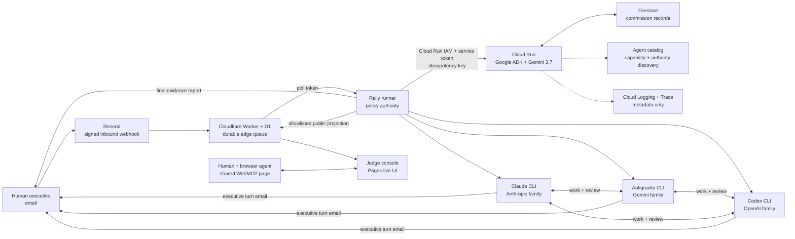

# Architecture and trust boundaries

Rally is a hybrid agent system: Google Cloud provides durable, authenticated
coordination; a controlled workstation provides licensed Gemini, Claude, and
OpenAI Codex runtimes; deterministic code—not a model—decides whether work is done.

## What each layer is allowed to decide

| Layer | Authority | Explicitly cannot do |
|---|---|---|
| Email edge | Verify webhook, queue, deduplicate delivery | Approve a sender or complete work |
| Google ADK coordinator | Preserve the request verbatim and produce a bounded handoff | Modify files, invent evidence, waive review |
| Rally runner | Authenticate commissioners, advance state, authorize bounded Second Wind recovery, enforce budgets and verification | Change its own policy from model output |
| Gemini / Claude / OpenAI workers | Scope, implement, test, reject, and repair work | Verify their own checklist items or share credentials across users |
| Connector gateway | Discover approved remote MCP tools, enforce a frozen per-run allowlist, call read tools, write content-free receipts | Reveal OAuth tokens, widen authority, or execute gated writes |
| WebMCP page | Search public runs, inspect bounded verification receipts, populate a visible job draft | Read private runs, transmit a draft, connect a provider, or grant authority |
| Firestore | Atomically claim request keys and retain coordinator state | Trigger unbounded retries |

## The completion invariant

An item follows `open → claimed → awaiting-verification → done`. The transition
to `done` is rejected unless `verified_by` names a different worker than the one
that owned the item. Startup separately guarantees that every worker has a
distinct model family. Both invariants are enforced in code; model prose is
never authoritative.

## Replay and restart behavior

- Resend event IDs are deduplicated at the Worker edge.
- The original mail message ID becomes the Cloud request idempotency key.
- Firestore claims that key and creates the run record in one transaction, so
  concurrent delivery has one winner.
- A duplicate receives the existing record and cannot start a second Gemini
  coordination.
- A failed coordination can be reclaimed immediately; an interrupted attempt
  can be reclaimed only after its lease expires. Attempt fencing prevents stale
  work from overwriting the new owner.
- The edge deletes a commission only after the runner handles it. A transient
  Resend hydration error or local exception leaves the D1 row queued.
- The local runner persists its complete state after every accepted transition.
- With Second Wind enabled, a failed process never becomes accepted state. Rally
  records the failure, preserves the checklist, and asks the next family to
  inspect any partial workspace edits before taking custody.

## Fleet discovery and lifecycle

Authenticated operators can inspect `GET /v1/agents` to discover each approved
agent's model family, framework/runtime, capabilities, department scope,
authority, prohibitions, and lifecycle status. The versioned source catalog is
`cloud/agent_catalog.json`; prompts and credentials are never part of discovery.

Every Cloud commission records creation/update timestamps, attempt number,
retention horizon, status, and lease metadata. The catalog declares 30-day
retention; production cleanup remains an operator-controlled policy so evidence
is not deleted during judging.

## Authentication

The Cloud Run service is not public. A commission must pass two independent
checks:

1. Cloud Run IAM accepts only the least-privilege `rally-local-invoker` service
   account. `imterryim@gmail.com` may mint its short-lived, service-audience ID
   tokens but cannot turn an ordinary user token into an invocation.
2. The FastAPI service compares `X-Rally-Service-Token` with a Secret Manager
   value using constant-time comparison.

The local bridge impersonates that identity with `gcloud`, binds the token's
audience to the exact Cloud Run URL, and reads the application token from macOS
Keychain. Neither credential is stored in config, Firestore, email, logs, or
git.

Customer administration uses a distinct boundary. Google Identity Services
issues a browser ID token for Rally's registered web audience. The public
control plane verifies the signature, issuer, expiry, audience, stable `sub`
claim, verified email, and any configured account or Workspace-domain
allowlist. That service identity can read connection metadata and use one KMS
key, but it cannot invoke the private coordinator. A compromised browser token
therefore cannot be exchanged for Rally's machine-to-machine authority.

Each hosted connector credential is encrypted with a newly generated 256-bit
AES-GCM data key and user/connector-bound associated data. Google Cloud KMS
wraps that data key; Firestore receives only the ciphertext, wrapped key,
non-secret status, and a one-way owner hash. No model-facing API exposes a
decrypt operation.

## Connector execution boundary

Every worker receives one local MCP surface, `rally-connectors`. Claude is
launched with a run-specific strict MCP config. Codex ignores the user's global
configuration and receives only the run gateway. Antigravity preflight refuses
connector runs unless the Rally gateway is its only enabled MCP server. The
gateway reads an immutable, secret-free authority snapshot, discovers tools from
the approved provider-pinned runtime endpoint, denies every tool not
explicitly allowlisted, and records content-free call receipts.

The authenticated commissioner selects a one-way connector profile. Enabled
systems, tool policies, OAuth Keychain services, and non-local Google ADC files
are isolated by that profile before the immutable run snapshot is created.
Google ADC or OAuth state stays behind the gateway; no model receives a provider
token. `human_approval` tools create an exact, expiring request bound to the
run, connector, tool, and complete argument digest; a human approves it and the
gateway consumes it once before the network call. Replay and substitution fail
closed. `verify_first` remains unavailable until an independent pre-execution
verifier is selected. See
[`CONNECTORS.md`](CONNECTORS.md) for the administrator sequence.

## Observability without prompt leakage

Cloud Trace captures request and Gemini spans. Structured Cloud Logging records
request ID, run ID, event, status, duplicate flag, latency, and trace linkage.
`ADK_CAPTURE_MESSAGE_CONTENT_IN_SPANS=false` and
`OTEL_INSTRUMENTATION_GENAI_CAPTURE_MESSAGE_CONTENT=NO_CONTENT` are set in both
code and infrastructure, so telemetry proves execution without retaining the
commission or model response.

## Genuine public console

The Pages console does not ship sample runs. An explicitly public demo profile
projects authoritative runner state to `PUT /v1/console/runs/:id` using the
existing server-to-server poll credential. The runner allowlists run ID, task,
model identity, accepted turn narratives, commit IDs, checklist transitions,
verifier identity, evidence, and terminal report. It excludes commissioner
address, local worktree, mail/thread identifiers, raw prompts, credentials, and
cloud request keys.

The Worker applies the allowlist again, stores the projection in a separate D1
table, and exposes public read-only list/detail routes. The browser labels that
source as live D1 data, polls it every 15 seconds, and shows an explicit empty or
error state instead of substituting a mock. The default production profile
cannot publish; public visibility is double opt-in in the demo configuration.

Supported browser agents receive three WebMCP tools over the same page:
bounded public-run search, bounded verification inspection, and visible job
drafting. The two read tools label public model/user content as untrusted. The
draft tool performs no network write and cannot launch work; it opens the same
managed-setup panel the person edits and leaves the consequential mail action
to that person. See [`WEBMCP.md`](WEBMCP.md).

## Per-user model authorization

Claude, Antigravity, and Codex authenticate through each operator's own provider
tooling. Codex uses Sign in with ChatGPT; its invocation is ephemeral and ignores
unrelated global MCP configuration. Rally does not collect, pool, resell, or
multiplex subscription credentials. A hosted multi-tenant deployment must use
provider APIs/business agreements or separately provisioned authorized seats.

## Why the hybrid runtime is deliberate

Claude, Antigravity, and Codex are licensed CLIs tied to authorized user
environments. Pretending those binaries run natively in Cloud Run would make the
diagram cleaner and the product false. Rally places durable coordination,
identity, state, and telemetry in Google Cloud while keeping licensed execution
on the host that can legally and reliably run it.
