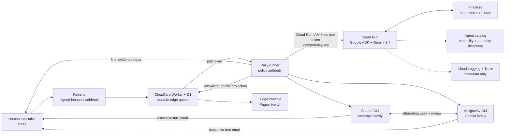

# Architecture and trust boundaries

Rally is a hybrid agent system: Google Cloud provides durable, authenticated
coordination; a controlled workstation provides the licensed Claude and Gemini
coding runtimes; deterministic code—not a model—decides whether work is done.

## What each layer is allowed to decide

| Layer | Authority | Explicitly cannot do |
|---|---|---|
| Email edge | Verify webhook, queue, deduplicate delivery | Approve a sender or complete work |
| Google ADK coordinator | Preserve the request verbatim and produce a bounded handoff | Modify files, invent evidence, waive review |
| Rally runner | Authenticate commissioners, advance state, enforce budgets and verification | Change its own policy from model output |
| Claude / Gemini workers | Scope, implement, test, reject, and repair work | Verify their own checklist items |
| Firestore | Atomically claim request keys and retain coordinator state | Trigger unbounded retries |

## The completion invariant

An item follows `open → claimed → awaiting-verification → done`. The transition
to `done` is rejected unless `verified_by` names the model family that did not
own the item. The invariant is enforced in `src/envelope.py`; model prose is
never authoritative.

## Replay and restart behavior

- Resend event IDs are deduplicated at the Worker edge.
- The original mail message ID becomes the Cloud request idempotency key.
- Firestore claims that key and creates the run record in one transaction, so
  concurrent delivery has one winner.
- A duplicate receives the existing record and cannot start a second Gemini
  coordination.
- A failed coordination can be reclaimed immediately; an interrupted attempt
  can be reclaimed only after its lease expires. Attempt fencing prevents stale
  work from overwriting the new owner.
- The edge deletes a commission only after the runner handles it. A transient
  Resend hydration error or local exception leaves the D1 row queued.
- The local runner persists its complete state after every accepted transition.

## Fleet discovery and lifecycle

Authenticated operators can inspect `GET /v1/agents` to discover each approved
agent's model family, framework/runtime, capabilities, department scope,
authority, prohibitions, and lifecycle status. The versioned source catalog is
`cloud/agent_catalog.json`; prompts and credentials are never part of discovery.

Every Cloud commission records creation/update timestamps, attempt number,
retention horizon, status, and lease metadata. The catalog declares 30-day
retention; production cleanup remains an operator-controlled policy so evidence
is not deleted during judging.

## Authentication

The Cloud Run service is not public. A commission must pass two independent
checks:

1. Cloud Run IAM accepts only the least-privilege `rally-local-invoker` service
   account. `imterryim@gmail.com` may mint its short-lived, service-audience ID
   tokens but cannot turn an ordinary user token into an invocation.
2. The FastAPI service compares `X-Rally-Service-Token` with a Secret Manager
   value using constant-time comparison.

The local bridge impersonates that identity with `gcloud`, binds the token's
audience to the exact Cloud Run URL, and reads the application token from macOS
Keychain. Neither credential is stored in config, Firestore, email, logs, or
git.

## Observability without prompt leakage

Cloud Trace captures request and Gemini spans. Structured Cloud Logging records
request ID, run ID, event, status, duplicate flag, latency, and trace linkage.
`ADK_CAPTURE_MESSAGE_CONTENT_IN_SPANS=false` and
`OTEL_INSTRUMENTATION_GENAI_CAPTURE_MESSAGE_CONTENT=NO_CONTENT` are set in both
code and infrastructure, so telemetry proves execution without retaining the
commission or model response.

## Genuine public console

The Pages console does not ship sample runs. An explicitly public demo profile
projects authoritative runner state to `PUT /v1/console/runs/:id` using the
existing server-to-server poll credential. The runner allowlists run ID, task,
model identity, accepted turn narratives, commit IDs, checklist transitions,
verifier identity, evidence, and terminal report. It excludes commissioner
address, local worktree, mail/thread identifiers, raw prompts, credentials, and
cloud request keys.

The Worker applies the allowlist again, stores the projection in a separate D1
table, and exposes public read-only list/detail routes. The browser labels that
source as live D1 data, polls it every 15 seconds, and shows an explicit empty or
error state instead of substituting a mock. The default production profile
cannot publish; public visibility is double opt-in in the demo configuration.

## Why the hybrid runtime is deliberate

Claude and Antigravity are subscription CLIs, and Antigravity is tied to its
desktop runtime. Pretending those binaries run natively in Cloud Run would make
the diagram cleaner and the product false. Rally places durable coordination,
identity, state, and telemetry in Google Cloud while keeping licensed execution
on the host that can legally and reliably run it.
