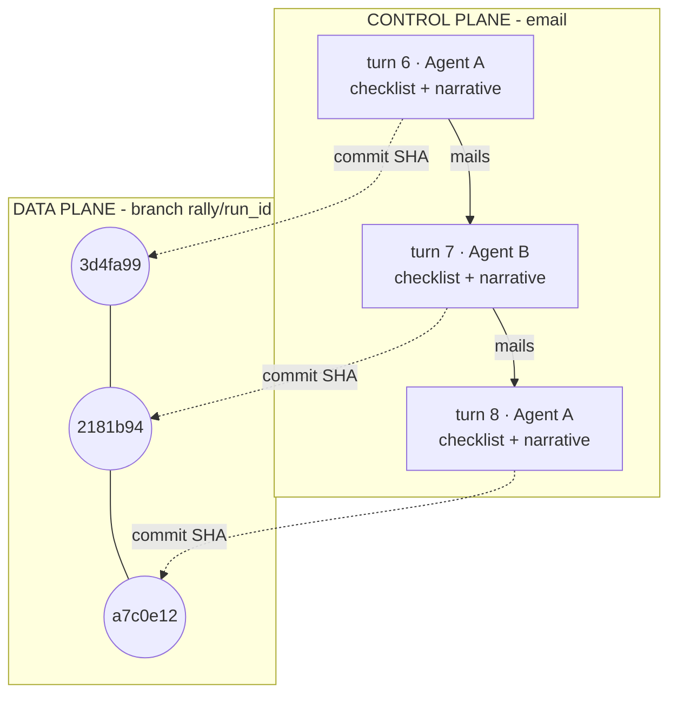
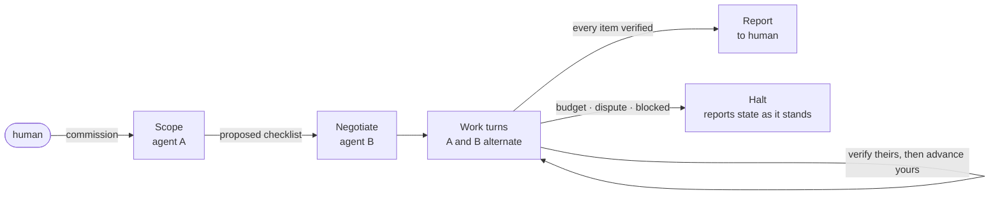
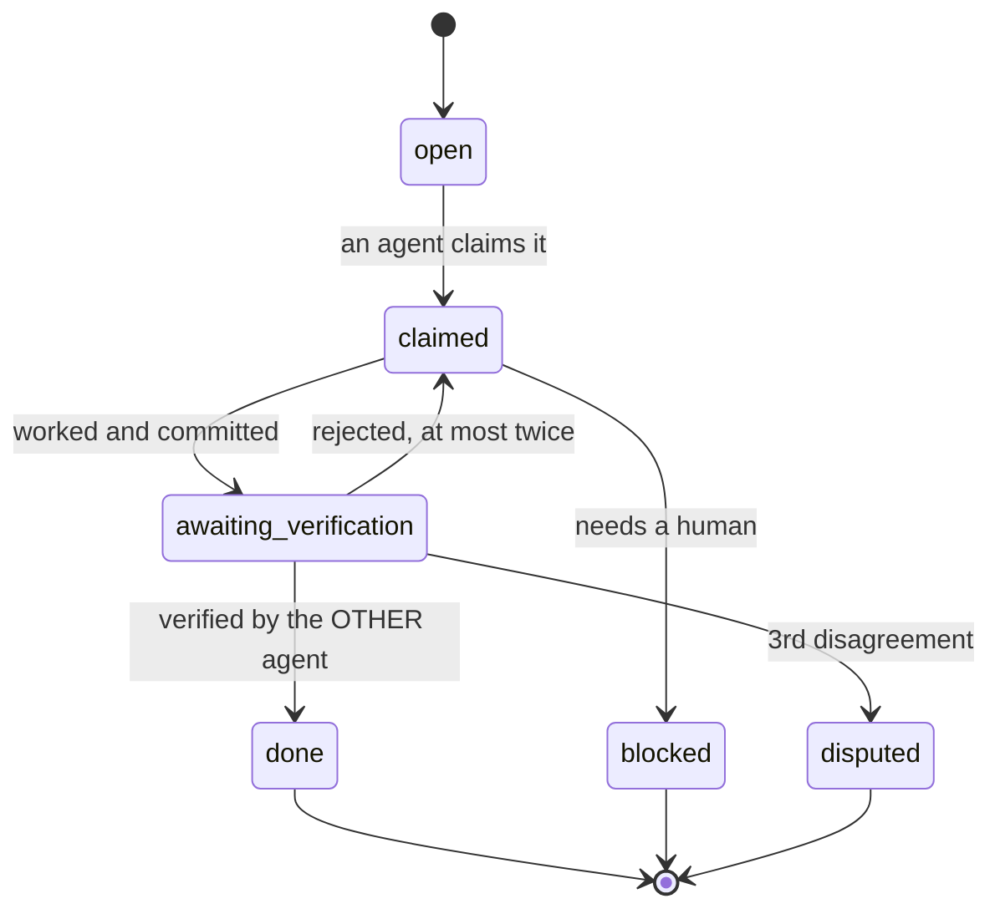
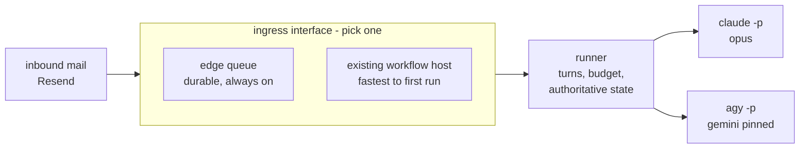

# Rally in four figures

Companion to [FOUNDING.md](FOUNDING.md) and [SPEC.md](SPEC.md).

## 1. Decisions travel in the message, artifacts live in git

One turn produces one message and one commit. The envelope carries the checklist,
the branch carries the work, and the SHA is the join. A lost message therefore
costs a turn rather than the run.

## 2. The human commissions once, then reads

Agreement on what "done" means comes before any work. A halt is a reported
outcome, not a crash: stopping and asking counts as success.

## 3. An item cannot be marked done by the agent that did it

Two bounds guarantee termination. On the second failure of the same item the
verifier may repair it, and ownership flips, so the original author must verify
the repair. Without the cap on that back edge the characteristic failure is not
a crash but an infinite, courteous exchange that burns budget.

## 4. Ingress is a swap point, not a rewrite

The runner holds authoritative state; an envelope is evidence, never authority.
Because the runner does not know which ingress it got, the choice is reversible.

Model pinning belongs here rather than in config: the Antigravity CLI also serves
Claude models, so an unpinned run can quietly become one family reviewing itself
while everything still appears to work.
